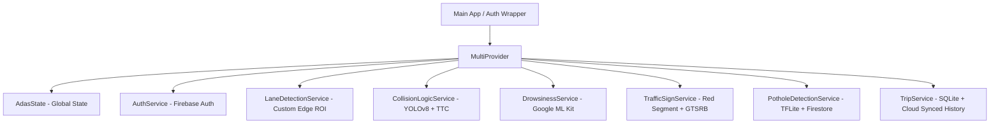

# 🛡️ ADAS Mobile: Advanced Driver Assistance System

[](https://flutter.dev)
[](https://tensorflow.org/lite)
[](https://firebase.google.com)
[](https://developers.google.com/ml-kit)
[](#)

An intelligent, on-device **Advanced Driver Assistance System (ADAS)** built with Flutter. ADAS Mobile turns any smartphone into a co-pilot, leveraging real-time computer vision, deep learning models (TensorFlow Lite), on-device sensors, and Firebase integration to provide safety alerts, driver drowsiness warnings, and crowdsourced road condition maps.

---

## 🚀 Core Safety Features

### 1. 🚗 Forward Collision Warning (FCW)
*   **Technology**: Real-time object detection using **YOLOv8 Nano (`yolov8n.tflite`)**.
*   **Lane Filtering**: Evaluates target hazards strictly within the central **40% field-of-view (middle lane)** to eliminate unrelated sidewalk objects.
*   **Time-To-Collision (TTC) Approximation**: Approximates threat levels by calculating the relative area ratio of detected bounding boxes (e.g., Pedestrian, Car, Truck, Bus, Motorcycle) in consecutive frames.
*   **Threat Levels**:
    *   **Safe**: No vehicle in lane or far away.
    *   **Warning (Yellow)**: Target occupies > 10% (vehicles) or > 4% (pedestrians) of screen area.
    *   **Danger (Red)**: Target occupies > 18% (vehicles) or > 8% (pedestrians) of screen area. Plays auditory alert (`sounds/alert.mp3`).

### 2. 🥱 Driver Drowsiness & Yawn Detection (DDWS)
*   **Technology**: High-speed eye and mouth tracking powered by **Google ML Kit Face Detection**.
*   **Drowsiness Algorithm**: Measures the Eye Aspect Ratio (EAR) using left and right open probabilities (`leftEyeOpenProbability`, `rightEyeOpenProbability`).
*   **Sustained Analysis**: Triggers a persistent drowsiness alert when eyes remain closed (probability < 0.20) for **12+ consecutive frames** to avoid false alerts on normal blinking.

### 3. 🛣️ Lane Departure Warning System (LDWS)
*   **Technology**: Real-time edge gradient thresholding and white pixel segmentation.
*   **Region-of-Interest (ROI)**: Restricts analysis to the **bottom 40% of the camera frame** to isolate road lane markings.
*   **Deviation Detection**: Calculates a smoothed center offset (`lastOffset`). When the lateral displacement delta exceeds the threshold of `0.15` relative to the lane width, the driver is warned of a lane departure.
*   **Cooldown**: Utilizes a smart 2-second cooldown to suppress redundant alerts while returning to the center.

### 4. 🛑 Traffic Sign Recognition (TSR)
*   **Technology**: Bounding box extraction + **GTSRB CNN Model (`traffic_signs.tflite`)**.
*   **Sign Extraction**: Fast red-channel thresholding filter `(R > 150 && G < 120 && B < 120)` maps red circles (Speed limits, Stop signs) and automatically crops bounding boxes.
*   **Inference**: Feeds cropped 32x32 pixel images to the CNN model classifier mapping **43 distinct categories**.
*   **Filter Stability**: Incorporates a 90% confidence threshold and a **3-frame stability latch** to deliver near-zero false-positive rates.

### 5. 🕳️ Pothole Detection & Crowdsourcing
*   **Technology**: MobileNet/ResNet binary classifier (`pothole_detection.tflite`) + GPS coordinates.
*   **On-Device Inference**: Analyzes road camera feeds to classify structural surface anomalies with high confidence.
*   **Crowdsourced Mapping**: When a pothole is classified, the app grabs exact location coordinates via `Geolocator` and uploads them in real-time to a global Firebase Firestore collection.
*   **Proactive Alerts**: Periodically queries nearby potholes from Firestore and warns the driver if there are hazards within 500 meters.

---

## 🛠️ Tech Stack & Key Dependencies

| Component | Library / Framework | Purpose |
| :--- | :--- | :--- |
| **Framework** | **Flutter SDK >= 3.0.0** | Cross-platform UI & Engine |
| **State Management** | **Provider** | Reactive UI architecture |
| **Deep Learning** | **tflite_flutter** | Low-latency on-device AI inference |
| **Face Analysis** | **google_mlkit_face_detection** | Driver drowsiness & eye state monitoring |
| **Database (Local)** | **sqflite**, **shared_preferences** | Local trip history log and settings storage |
| **Cloud Integration** | **firebase_core**, **firebase_auth**, **cloud_firestore**, **firebase_storage** | High-performance backend & global pothole database |
| **Hardware Access** | **camera**, **geolocator**, **sensors_plus** | Frame capture, GPS position tracking, accelerometer readings |
| **Background Tasks** | **workmanager** | Background pothole scanning & location tracking during trips |
| **Audio & Alerts** | **audioplayers**, **flutter_local_notifications**, **flutter_tts**| Sound alarms, pushes notifications, and text-to-speech warnings |

---

## 📂 System Architecture & Services

The application adopts a decoupled services-oriented architecture managed by `MultiProvider` in `lib/main.dart`:



### Key Services Explained:
*   **`CollisionLogicService`**: Evaluates active targets (`person`, `car`, etc.) within the dynamic center cone and fires warning buzzers.
*   **`TripService`**: Creates unique trip instances, captures average speeds, tracks alert tallies (number of drowsiness events, pothole events), saves them to a local SQLite database, and synchronizes them with Firestore on completion.
*   **`BackgroundService`**: Harnesses Flutter's `Workmanager` to track current locations and notify users of nearby potholes even when the screen is locked.

---

## 💻 Installation & Setup

Follow these steps to set up and run the project locally.

### 📋 Prerequisites
*   [Flutter SDK](https://docs.flutter.dev/get-started/install) installed (version `>=3.0.0`).
*   Android Studio / Xcode with a physical device connected (Camera features require physical hardware).

### ⚙️ Step-by-Step Configuration

1.  **Clone the Repository**:
    ```bash
    git clone https://github.com/sruthyes/adas_app.git
    cd adas_app
    ```

2.  **Install Dependencies**:
    ```bash
    flutter pub get
    ```

3.  **Set Up Firebase**:
    *   Create a Firebase project at [Firebase Console](https://console.firebase.google.com).
    *   Add Android/iOS apps in the console.
    *   Download `google-services.json` (Android) and place it under `android/app/`.
    *   Download `GoogleService-Info.plist` (iOS) and place it under `ios/Runner/`.
    *   Enable **Email/Password** Auth, **Firestore Database**, and **Firebase Storage**.

4.  **Confirm TFLite Model Placement**:
    Ensure the following deep learning models are present in your local assets folder:
    *   `assets/ml_models/yolov8n.tflite` (Forward Collision)
    *   `assets/ml_models/traffic_signs.tflite` (Traffic Signs)
    *   `assets/ml_models/pothole_detection.tflite` (Pothole Classifier)
    *   `assets/labels/labels.txt` (GTSRB Class names)

5.  **Compile & Run**:
    *   **Android**:
        ```bash
        flutter run
        ```
    *   **iOS** (Required camera configurations in `Info.plist` are pre-configured):
        ```bash
        flutter run
        ```

---

## 🛡️ License & Attributions
*   **YOLOv8** developed by [Ultralytics](https://github.com/ultralytics).
*   **German Traffic Sign Recognition Benchmark (GTSRB)** datasets used for model training.
*   Built with ❤️ for safer driving.
