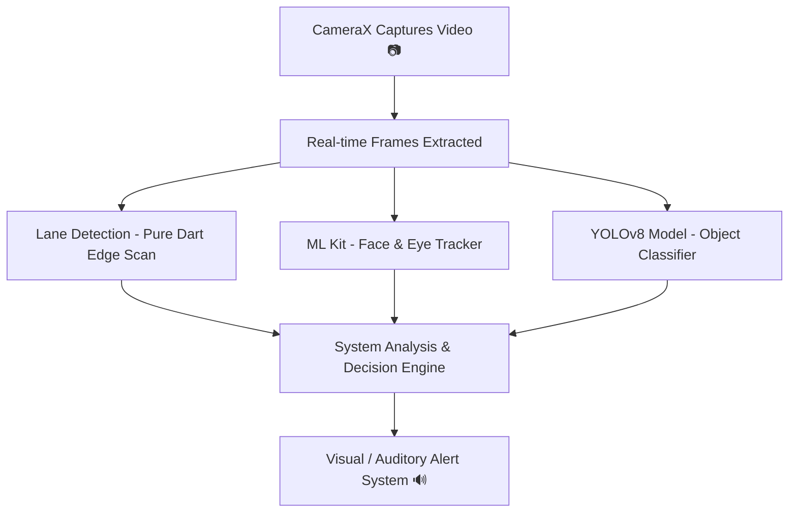

# 🛡️ NEXRA ADAS: Advanced Driver Assistance System

[](https://flutter.dev)
[](https://tensorflow.org/lite)
[](https://developers.google.com/ml-kit)
[](#)

**NEXRA ADAS** is a highly efficient, on-device mobile **Advanced Driver Assistance System** built using **Flutter**. Designed to run smoothly on standard smartphones, NEXRA utilizes live camera streams, real-time edge processing, custom pixel-level computer vision, and optimized deep learning models to actively assist drivers, enhance road safety, and track trip diagnostics.

---

## ⚙️ Tech Stack (Easy Explanation)

*   **📱 App Development: Flutter**
    *   Used to build the responsive cross-platform mobile application and manage local application state.
*   **📷 Camera: CameraX (Camera package)**
    *   Captures high-frame-rate live video feeds from the device's camera sensor in real time.
*   **🤖 Artificial Intelligence & Machine Learning:**
    1.  **Google ML Kit**:
        *   **Used for**: Face detection, eye tracking, and driver head drooping analysis.
        *   **Advantage**: Light, high-performance, and perfectly optimized for on-device mobile vision tasks.
    2.  **YOLOv8 (TensorFlow Lite - `yolov8s_int8.tflite`)**:
        *   **Used for**: Fast, real-time object detection (recognizing cars, pedestrians, motorcycles, and trucks).
        *   **Advantage**: Quantized model size runs smoothly without server reliance.

---

## 🧠 How the System Works (Step-by-Step Pipeline)



1.  **Camera Capture**: CameraX grabs high-resolution road frames at 30+ FPS.
2.  **Frame Distribution**: Each frame is concurrently piped to the active vision pipelines.
3.  **Lane Detection**: Manual pixel-processing algorithm detects boundary lines.
4.  **ML Kit Eye Tracking**: Monitors eyes and head positions for fatigue.
5.  **YOLO Model Inference**: Locates vehicles, pedestrians, and obstacles.
6.  **Intelligent Alert Engine**: Synthesizes inputs to fire:
    *   *Lane Departure Alarms*
    *   *Driver Drowsiness Notifications*
    *   *Collision Risk Proximity Warnings*
    *   *Traffic Sign Classification Overlays*

---

## 🔬 Core Feature Implementations

### 1. 🛣️ Lane Detection (Pure Dart Implementation)
Unlike standard apps that rely on heavy external libraries like OpenCV, NEXRA implements lane detection **manually in pure Dart** by processing raw image frame pixels.

*   **Grayscale Conversion**: Pixels are converted to grayscale using the standard luminance formula:
    $$\text{Grayscale} = 0.3R + 0.59G + 0.11B$$
*   **Region-of-Interest (ROI)**: Isolates processing strictly to the **bottom region of the camera frame** (where the road lanes naturally lie), saving CPU cycles.
*   **Edge Detection**: Identifies edges by manually comparing pixel intensity differences between neighboring horizontal pixels. A sudden difference in brightness denotes a road line edge.
*   **Line Slope Matching**: Determines lane trajectory based on pixel alignment and slope calculation.
*   **💡 Why This is an Advantage**:
    *   **No heavy external dependencies** (zero library bloat).
    *   **Maximum control** over the edge detection and line drawing algorithms.
    *   **Highly lightweight** and runs beautifully on budget devices.

### 2. 🥱 Driver Drowsiness Detection
Monitors the driver's state of alertness using Google ML Kit's Face Detection.
*   **Face Tracking**: Locates the driver’s face and estimates key facial landmarks.
*   **Eye Closure Analysis**: Tracks left/right eye opening probabilities.
*   **Head Droop**: Measures the vertical head tilt/drooping pattern.
*   **Alert Condition**: If the driver's eyes remain closed or their head droops below threshold values for a sustained period, the system assumes drowsiness and triggers active alerts.

### 3. 🚗 Collision Warning System (Distance Estimation)
NEXRA warns the driver when the vehicle is closing in on an obstacle and there is a risk of a crash.
*   **Object Recognition**: Runs `yolov8s_int8.tflite` to detect `cars`, `bikes`, and `people`, returning bounding boxes.
*   **Distance Approximation**: Since smartphones lack hardware LiDAR/radar sensors, NEXRA estimates distance using **Bounding Box Size**:
    *   **Bigger bounding box** $\rightarrow$ Object is **close**.
    *   **Smaller bounding box** $\rightarrow$ Object is **far away**.
*   **Logic Rule**: 
    $$\text{If } (\text{Object Size} > \text{Threshold} \quad \text{AND} \quad \text{Object Position} \in \text{Center Cone}) \rightarrow \text{Trigger Warning}$$
*   **Audio Alerts**: Sounds immediate visual warnings on screen accompanied by auditory beep tracks.

### 🛑 4. Traffic Sign Detection (GTSRB Model)
NEXRA scans the roadside for traffic signs using a custom model trained on the world-standard **GTSRB** dataset.
*   **What is GTSRB?** The *German Traffic Sign Recognition Benchmark*—a massive dataset containing thousands of images of traffic signs across 43 categories (Stop signs, Speed limits, warnings, etc.).
*   **The Pipeline**:
    1.  **Model Training**: Model learns the shape, colors (red bounding rings), and patterns of traffic signs.
    2.  **TFLite Conversion**: Converted to `traffic_signs.tflite` for mobile CPU/NPU optimization.
    3.  **Real-Time Detection**: App segments red circular sign coordinates, crops the patch, runs classification, and alerts the driver (e.g. *"Speed Limit 60"*, *"Stop Sign"*).

---

## 🗂️ Modular File Structure (Exam-Ready)

NEXRA follows a highly modular, service-oriented architecture:

```text
adas_app/
├── assets/
│   ├── ml_models/               # Deep learning brains (.tflite format)
│   │   ├── yolov8n.tflite       # Forward collision detector
│   │   ├── traffic_signs.tflite # GTSRB-trained sign classifier
│   │   ├── pothole_detection.tflite # Pothole surface classifier
│   │   └── drowsiness.tflite    # Driver drowsiness checker
│   ├── labels/                  # Mapping file output -> readable labels
│   │   ├── labels.txt
│   │   └── traffic_sign_labels.txt
│   └── sounds/                  # Auditory warning audio files
│       ├── alert.mp3
│       └── beep.mp3
├── lib/
│   ├── main.dart                # App entry point (initializes services & UI)
│   ├── services/                # CORE LOGIC: Most Important Folder
│   │   ├── lane_detection_service.dart      # Pure Dart pixel lane processing
│   │   ├── drowsiness_detection_service.dart# Google ML Kit eye-state trackers
│   │   ├── collision_logic_service.dart     # Decision maker for crash risks
│   │   ├── collision_warning_service.dart   # Auditory buzzer trigger services
│   │   ├── traffic_sign_service.dart        # GTSRB sign classification logic
│   │   ├── pothole_detection_service.dart   # Potholes GPS crowdsource logger
│   │   └── trip_service.dart                # Diagnostics logger (SQLite database)
│   ├── screens/                 # UI Screen Interfaces
│   │   ├── adas_camera_screen.dart          # Main active camera processing UI
│   │   ├── dashboard_screen.dart            # Performance metrics & trips
│   │   └── settings_screen.dart             # Detection sensitivities & alerts
│   ├── utils/                   # Pre/Post processing for ML & Images
│   │   ├── image_preprocessor.dart
│   │   └── yolo_decoder.dart
│   └── database/                # SQLite local relational database helpers
│       └── database_helper.dart
└── pubspec.yaml                 # Registers ML models, sounds, and icons
```

---

## 🔢 Key Technical Thresholds

*   **YOLO Bounding Box Limit**: Target confidence threshold set at $\ge 0.50$ (ignores weak detections).
*   **Luminance Grayscale Weighting**: $0.299R + 0.587G + 0.114B$ (approximated as $0.3R + 0.59G + 0.11B$ for faster integer math).
*   **Lane Departure Lateral Delta**: Triggered if lateral displacement delta exceeds $0.15$ from lane center bounds.
*   **Drowsiness Sustain Timer**: Triggers when eye opening ratio falls below $0.20$ for more than $12$ consecutive frames.
*   **Collision warning zone**: Objects located in the center $40\%$ horizontal region of the frame (ignoring lanes to the left/right).
